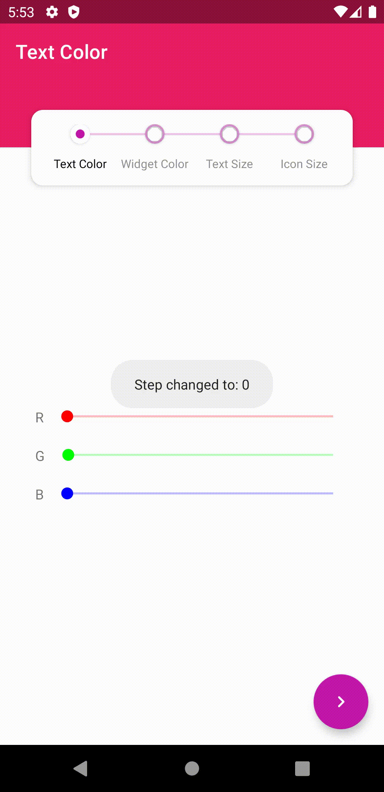
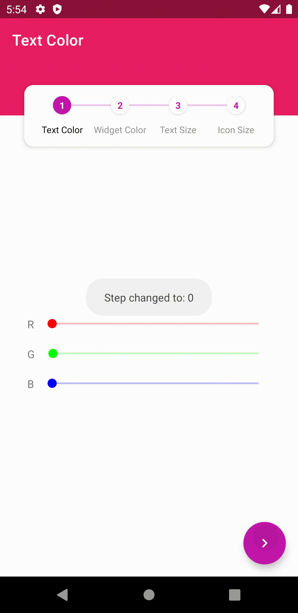

<p align="center"></p>

# Android Stepper

[](https://github.com/acefalobi/android-stepper/actions?query=workflow%3A%22Android+Build%22) [](https://github.com/acefalobi/android-stepper/releases) 

A library for creating a wizard-like step-through user interface that uses navigation components and menus for displaying steps with advanced customization. The implementation is similar to what is done in Google's [BottomNavigationView](https://developer.android.com/guide/navigation/navigation-ui?hl=TR#bottom_navigation).

This project is also inspired by [https://github.com/stepstone-tech/android-material-stepper](https://github.com/stepstone-tech/android-material-stepper)

See the [Sample app](https://github.com/acefalobi/android-stepper/tree/master/app) for a full range of the features and implementations of the library.

## Jump to section

* [Stepper Types](#stepper-types)
  * [WIP](#wip)
* [Features](#features)
* [Installation](#installation)
* [Usage](#usage)
  * [Create a Menu with the Steps](#create-a-menu-with-the-steps)
  * [Create a Nav Graph with Step Fragments using corresponding menu item ids](#create-a-nav-graph-with-step-fragments-using-corresponding-menu-item-ids)
  * [Add StepperNavigationView to layout with the menu](#add-steppernavigationview-to-layout-with-the-menu)
  * [Add NavHost fragment to layout with the nav graph](#add-navhost-fragment-to-layout-with-the-nav-graph)
  * [Setup Stepper with Navigation Controller](#setup-stepper-with-navigation-controller)
  * [Add StepperNavListener to Activity (optional)](#add-steppernavlistener-to-activity-optional)
* [Advanced Usage](#advanced-usage)
  * [Setup with Action Bar](#setup-with-action-bar)
  * [Override back button to go up](#override-back-button-to-go-up)
  * [Update Menu Programmatically](#update-menu-programmatically)
* [XML Attributes](#xml-attributes)
* [Contributing](#contributing)
* [License](#license)

## Stepper Types

* Tabs

* Numbered Tabs

* Progress

* Fleets (Stories)

&nbsp;&nbsp;&nbsp;&nbsp;

### WIP

* Custom Icons Stepper

* Text-Only Stepper

## Features

* AndroidX Navigation Components

* Fragment transition animations

* Color customization

* Multiple stepper types

## Installation

**Add the Jitpack repository to your root `build.gradle`**

Gradle:

```gradle
allprojects {
    repositories {
        // ...
        maven { url 'https://jitpack.io' }
    }
}
```

Kotlin DSL:

```kotlin
allprojects {
    repositories {
        // ...
        maven("https://jitpack.io")
    }
}
```

**Add the dependency to your module**

Gradle:

```gradle
dependencies {
    implementation 'com.github.acefalobi:android-stepper:0.2.1'
}
```

Kotlin DSL:

```kotlin
dependencies {
    implementation("com.github.acefalobi:android-stepper:0.2.1")
}
```

## Usage

### Create a Menu with the Steps

```xml
<menu xmlns:android="http://schemas.android.com/apk/res/android">

    <item android:id="@+id/step_1_dest"
        android:title="Step 1" />

    <item android:id="@+id/step_2_dest"
        android:title="Step 2" />

    <item android:id="@+id/step_3_dest"
        android:title="Step 3" />

</menu>

```

### Create a Nav Graph with Step Fragments using corresponding menu item ids

***Remember to use the same ids for the menu and nav graph items.***

```xml
<navigation xmlns:android="http://schemas.android.com/apk/res/android"
    xmlns:app="http://schemas.android.com/apk/res-auto"
    android:id="@+id/nav_stepper"
    app:startDestination="@id/step_1_dest">

    <fragment
        android:id="@+id/step_1_dest"
        android:name=".steps.Step1Fragment"
        android:label="Step 1" />

    <fragment
        android:id="@+id/step_2_dest"
        android:name=".steps.Step2Fragment"
        android:label="Step 2" />

    <fragment
        android:id="@+id/step_3_dest"
        android:name=".steps.Step3Fragment"
        android:label="Step 3" />

</navigation>
```

### Add StepperNavigationView to layout with the menu

```xml
<com.aceinteract.android.stepper.StepperNavigationView
    android:id="@+id/stepper"
    android:layout_width="match_parent"
    android:layout_height="wrap_content"
    app:stepperItems="@menu/menu_stepper"
    app:stepperType="@string/stepper_type_tab" />
```

See [XML Attributes](#xml-attributes) for full list of attributes.

### Add NavHost fragment to layout with the nav graph

```xml
<fragment
    android:id="@+id/frame_stepper"
    android:name="androidx.navigation.fragment.NavHostFragment"
    android:layout_width="match_parent"
    android:layout_height="match_parent"
    app:navGraph="@navigation/nav_stepper" />
```

### Setup Stepper with Navigation Controller

```kotlin
val stepper = findViewById<StepperNavigationView>(R.id.stepper)
stepper.setupWithNavController(findNavController(R.id.frame_stepper))
```

### Go back and forth between steps

```kotlin
stepper.goToPreviousStep()
stepper.goToNextStep()
```

### Add StepperNavListener to Activity (optional)

```kotlin
class StepperActivity : AppCompatActivity(), StepperNavListener {

    override fun onStepChanged(step: Int) {
        Toast.makeText(this, "Step changed to: $step", Toast.LENGTH_SHORT).show()
    }

    override fun onCompleted() {
        Toast.makeText(this, "Stepper completed", Toast.LENGTH_SHORT).show()
    }

}
```

```kotlin
stepperNavListener = this
```

## Advanced Usage

### Setup with Action Bar

Setup action bar with top-level destinations so that the action bar title changes with the steps.

```kotlin
setupActionBarWithNavController(
    findNavController(R.id.frame_stepper),
    AppBarConfiguration.Builder(
        R.id.step_1_dest,
        R.id.step_2_dest,
        R.id.step_3_dest
    ).build()
)
```

If you want to override the up navigation with the nav controller

```kotlin
setupActionBarWithNavController(findNavController(R.id.frame_stepper))
```

```kotlin
override fun onSupportNavigateUp(): Boolean =
    findNavController(R.id.frame_stepper).navigateUp()
```

### Override back button to go up

```kotlin
override fun onBackPressed() {
    if (stepper.currentStep == 0) {
        super.onBackPressed()
    } else {
        findNavController(R.id.frame_stepper).navigateUp()
    }
}
```

### Update Menu Programmatically

First make sure the menu item already has corresponding destination in the nav graph.

```kotlin
stepper.menu.add(groupId, R.id.step_4_dest, order, "New Step")
```

## XML Attributes

| Attribute name | Format | Description |
| - | - | - |
| *stepperItems* | reference (menu) | **REQUIRED:** Menu to get steps from |
| *stepperType* | one of `tab`, `tab_numbered`, `progress`, or `fleets` | The type of stepper |
| *stepperIconSize* | dimension | The size of the icons |
| *stepperTextAppearance* | reference (style) | The style of the labels |
| *stepperTextColor* | color | The color of the labels |
| *stepperTextSize* | dimension | The size of the labels |
| *stepperWidgetColor* | color | The color of widgets like icons and progress bars |
| *stepperFleetDuration* | integer | The duration (in milliseconds) that fleets should last for |

## Contributing

See [CONTRIBUTING.md](https://github.com/acefalobi/android-stepper/blob/master/CONTRIBUTING.md) for contributing guidelines

## TODO

* Add more stepper types

* Write tests.

* Setup CI to automate testing

* Publish as package

## License

Copyright 2020 Ayomide Falobi

Licensed under the Apache License, Version 2.0 (the "License"); you may not use this file except in compliance with the License. You may obtain a copy of the License at [http://www.apache.org/licenses/LICENSE-2.0](http://www.apache.org/licenses/LICENSE-2.0)

Unless required by applicable law or agreed to in writing, software distributed under the License is distributed on an "AS IS" BASIS, WITHOUT WARRANTIES OR CONDITIONS OF ANY KIND, either express or implied. See the License for the specific language governing permissions and limitations under the License.
